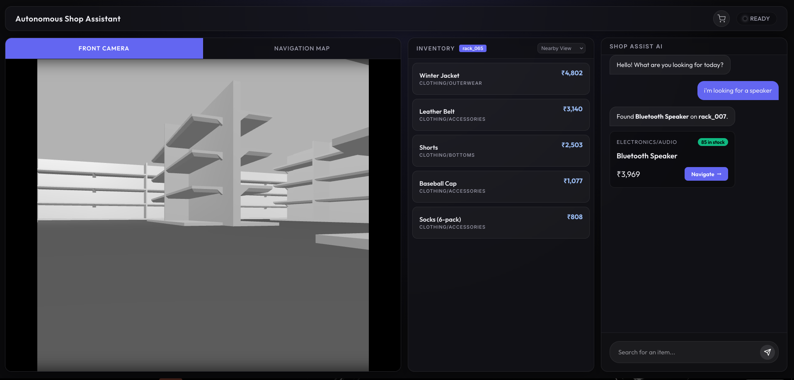
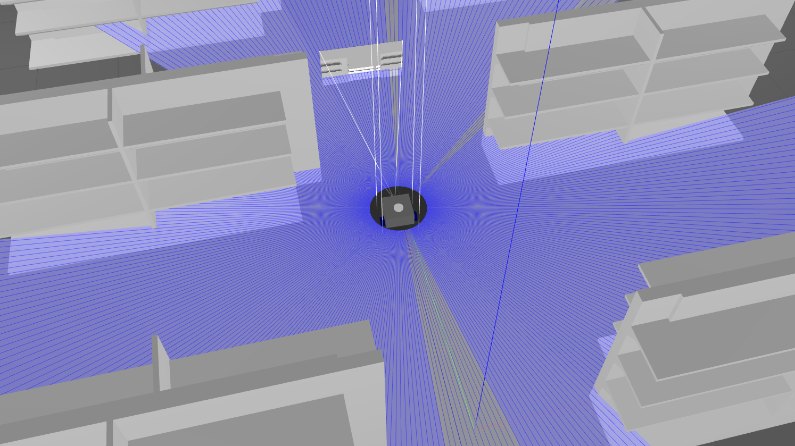
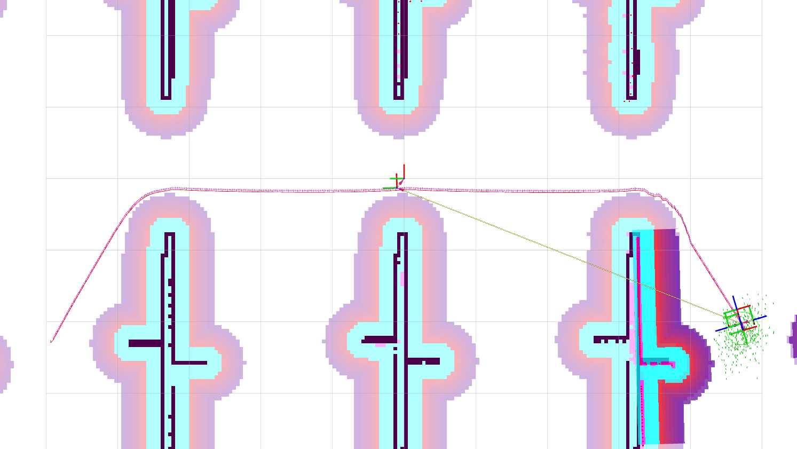

<div align="center">
  <h1>ShopAssist</h1>

  <sub>Formerly Autonomous Shopper Assistance System<sub>
  
  <p>
    ShopAssist is an 
    <a href="https://en.wikipedia.org/wiki/Automated_convenience_store">
      Autonomous Shopper Assistance System
    </a> 
    which aims to provide an effortless shopping experience to customers in retail environments.
    Disguised as a shopping cart, it navigates autonomously to lead the user to their desired products or follow them around, removing the physical hassle of handling a cart.
  </p>
  <br>

[](https://www.python.org/)
[](https://ros.org/)
[](https://www.langchain.com/)
[](https://fastapi.tiangolo.com/)
[](https://www.mongodb.com/)
[](https://react.dev/)
[](https://www.docker.com/)
[](https://podman.io/)

<br>
</div>

---

> [!WARNING]
> The copyright of this project is held by a corporate.<br>
> Kindly read the [LICENSE](https://github.com/muditmehta07/asas#license) before cloning or copying this project.

## Showcase
<div align="center">
  
  <div style="display: flex; justify-content: space-between; margin-top: 10px;">
    
    
  </div>
</div>


## Folders

```text
├── backend          # fastapi server
├── frontend         # react dashboard
├── ros_ws           # ros2 workspace
├── rack_model       # rack model (duh)
├── mongo-seed       # database
└── docker-compose.yml
```

## Installation

- **Linux** or **macOS** (via Docker or Podman)
- `xhost` installed (optional, for GUI forwarding)

1. **Clone the repo:**
   ```bash
   git clone https://github.com/muditmehta07/asas.git
   cd asas
   ```

2. **Allow Docker/Podman to access X server:**
   ```bash
   xhost +local:docker
   ```
   or
   ```bash
   xhost +local:podman
   ```

4. **Launch:**

   **Using Docker:**
   ```bash
   sudo docker compose -f docker-compose.yml up --build
   ```

   **Using Podman:**
   ```bash
   podman-compose -f compose.yaml up --build
   ```
5. **Open dashboard at** http://localhost:5173
   
## Contributing

Anyone can contribute to this project, just send a PR.

> [!IMPORTANT]
> While submitting a Pull Request, please add an `[ai]` flag to your commit message if your contribution contains AI code. This helps maintain transparency.


## License

This project is developed and maintained by [muditmehta07](https://github.com/sponsors/muditmehta07/)

Licensed under the **GNU Affero General Public License v3.0 (AGPL-3.0)**. Read fill [LICENSE](https://github.com/muditmehta07/asas/blob/main/LICENSE)
> [!WARNING]
> Under the terms of the AGPL-3.0, any modifications or use of this software in a network service must be made available under the same license. For commercial licensing, proprietary integrations, or partnerships, please contact the firm's technical department.

Copyright © 2026 FOUR M Education and Technology Private Limited.
